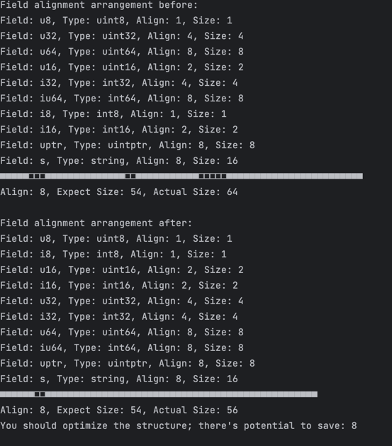

# GoOptimizer

Optimization tools for Golang. Aligning memory for structs.

[gooptimizer](https://github.com/lizongying/gooptimizer)

[中文](./README_CN.md)

## Features

* Perform memory alignment on structures.

## Install

```shell
go get -u github.com/lizongying/gooptimizer
```

## Usage

Note: For convenience, this tool only handles structures smaller than 256 bytes.

It's advisable to conduct testing on all structures.

Simple usage:

```go
package main

import (
	"fmt"
	"github.com/lizongying/gooptimizer"
)

type T1 struct {
	u8   uint8
	u32  uint32
	u64  uint64
	u16  uint16
	i32  int32
	iu64 int64
	i8   int8
	i16  int16
	uptr uintptr
	s    string
}

func main() {
	should := gooptimizer.StructAlign(new(gooptimizer.Alignment))
	fmt.Println(should)

	// print
	//gooptimizer.StructAlignWithPrint(new(gooptimizer.Alignment))

	// cn print
	//gooptimizer.StructAlignWithCNPrint(new(T1))
}
```

```go
package main

import (
	"github.com/lizongying/gooptimizer"
	"testing"
)

func TestMain_T1(t *testing.T) {
	result := gooptimizer.StructAlign(new(T1))
	if !result {
		t.Errorf("Expected true, but got %t", result)
	}
}

func TestMain_Alignment(t *testing.T) {
	result := gooptimizer.StructAlign(new(gooptimizer.Alignment))
	if !result {
		t.Errorf("Expected true, but got %t", result)
	}
}
```

Result:

After reordering the field sequence, the size of the structure decreased from 64 bytes to 56 bytes.




